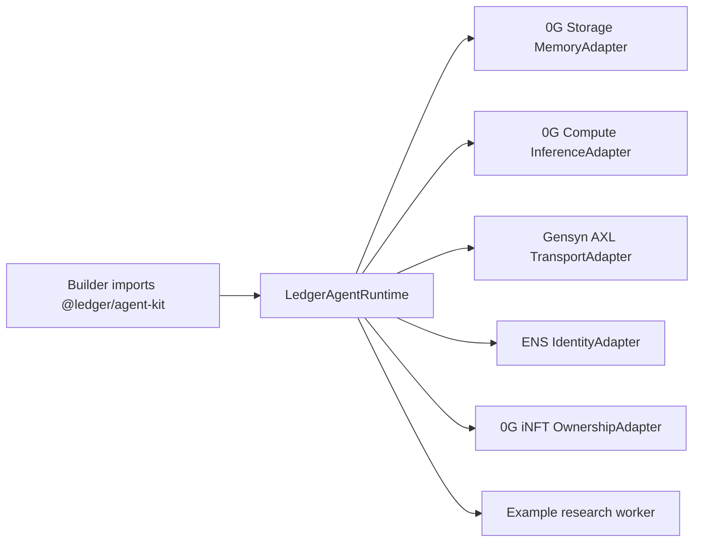

# Ledger Agent Kit

OpenClaw-inspired framework tooling for building ownable AI agents on 0G.

This package is the isolated **0G Track A** deliverable. The marketplace app is the flagship product built on the same primitives; this kit is the reusable developer layer judges can inspect, run, and adapt.

## What It Provides

- `LedgerAgentRuntime`: a small framework core for task intake, worker context loading, bid generation, and bid submission.
- `MemoryAdapter`: prepares encrypted agent memory through the existing 0G Storage path.
- `InferenceAdapter`: plugs into 0G Compute sealed reasoning, with a deterministic dry-run adapter for safe local examples.
- `TransportAdapter`: submits bids over the Gensyn AXL runtime.
- `IdentityAdapter`: resolves ENS capability names through the Ledger CCIP-Read resolver.
- `OwnershipAdapter`: reads the live 0G WorkerINFT token profile and `ownerOf` state.
- `examples/research-worker-agent.ts`: one working example agent built on the framework.

## Architecture



The standalone diagram file is [`docs/architecture.mmd`](docs/architecture.mmd).

## Run It

```bash
cd agents/ledger-agent-kit
npm install
npm run typecheck
npm test
LEDGER_ENS_GATEWAY_URL=https://resolver.fierypools.fun npm run example:research
```

The example defaults to a deterministic dry-run reasoner so it does not spend 0G Compute credits. It still reads the live demo worker through the 0G integration adapter and, for the proof run above, requires the ENS gateway capability tree to match the live WorkerINFT owner and memory CID before it emits a bid.

For an explicitly unverified local-only run:

```bash
LEDGER_AGENT_KIT_ALLOW_LOCAL_DRY_RUN=1 npm run example:research
```

That mode is intentionally labeled as local dry run and must not be used as sponsor proof.

## Live 0G Compute Mode

Swap `createDeterministicReasoner()` for `createZeroGComputeAdapter()` when you want paid sealed inference:

```ts
import { createZeroGComputeAdapter } from "@ledger/agent-kit";

const inference = createZeroGComputeAdapter({ model: "0g-qwen3.6-plus" });
```

This requires `PRIVATE_KEY` and the same 0G Compute budget rule used by `agents/0g-integration`: do not repeatedly call paid live compute without checking the remaining testnet budget.

## Why This Matters For 0G Track A

0G Track B is the application: iNFT workers with embedded memory, ownership transfer, and monetization.

0G Track A is this framework layer: developers can build a worker agent by swapping memory, reasoning, transport, identity, or ownership modules without touching the marketplace UI. The same example agent demonstrates the required working framework usage.
